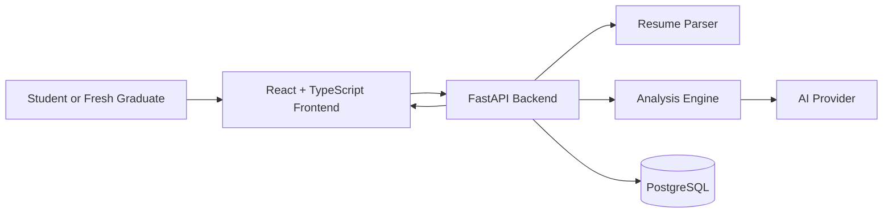

# CareerBoost AI

CareerBoost AI is an AI-powered internship readiness platform for university students and fresh graduates. The product is designed to analyze a resume, evaluate internship readiness, identify missing skills, recommend suitable internship roles, and provide a practical improvement plan.

This repository is being built as a production-quality engineering portfolio project. The goal is not to ship a quick demo, but to demonstrate architecture, product thinking, maintainability, documentation, and disciplined software delivery.

## Why CareerBoost AI Exists

Students often apply to internships without knowing whether their resume is ATS-friendly, whether their technical skills match the roles they want, or what they should improve next. Generic resume scanners usually provide shallow scores, while job boards rarely explain readiness gaps.

CareerBoost AI focuses on one core outcome: helping early-career candidates understand where they stand and what action to take next.

## Key Features Planned for Version 1.0

- Resume PDF upload with validation and safe failure handling.
- Resume text extraction with confidence-aware processing.
- ATS-focused resume feedback.
- Internship readiness scoring with explanations.
- Technical skill extraction and gap analysis.
- Internship role matching based on the candidate profile.
- Prioritized resume and learning recommendations.
- Analysis dashboard for reviewing results.
- Analysis history for tracking previous resume checks.

## Tech Stack

| Area | Technology |
| --- | --- |
| Frontend | React, Vite, TypeScript |
| Backend | FastAPI, Python |
| Database | PostgreSQL |
| Containerization | Docker |
| Local orchestration | Docker Compose |
| Version control | Git |

## High-Level Architecture Overview

CareerBoost AI will use a modular monolith architecture with Clean Architecture boundaries. The system is intentionally designed to be realistic for a single developer to build while still demonstrating professional separation of concerns.



Core architectural direction:

- The frontend presents workflows and results, but does not own business logic.
- The backend owns validation, orchestration, analysis coordination, and persistence.
- AI provider integration stays behind a backend infrastructure boundary.
- PostgreSQL stores analysis records and history.
- Docker Compose will provide a reproducible local development environment.

## Repository Structure

The repository is currently in Sprint 0 and contains foundational project files only. Application source code has not been created yet.

Planned structure:

```text
.
├── backend/      Coming in Sprint 1: FastAPI application
├── frontend/     Coming in Sprint 1: React + Vite + TypeScript application
├── docs/         Coming in Sprint 0: product and architecture documentation
├── docker/       Coming in Sprint 1: Docker support files
├── scripts/      Coming in Sprint 1+: maintained automation scripts
├── .github/      Repository templates and ownership configuration
└── README.md
```

## Development Roadmap

| Milestone | Focus | Status |
| --- | --- | --- |
| Sprint 0 | Repository foundation, product documentation, architecture documentation | In progress |
| Sprint 1 | Frontend and backend project scaffolding | Planned |
| Sprint 2 | Resume upload and validation workflow | Planned |
| Sprint 3 | Resume parsing and analysis pipeline | Planned |
| Sprint 4 | Dashboard, recommendations, history, and release hardening | Planned |

## Current Project Status

CareerBoost AI is in repository foundation mode.

Completed foundation work:

- Open-source license.
- Git ignore rules for the planned stack.
- Editor formatting configuration.
- Environment variable example.
- Contribution, conduct, security, changelog, ownership, issue, and pull request standards.

Not started yet:

- Frontend application.
- Backend application.
- Database schema.
- API contracts.
- Docker Compose runtime.
- Screenshots and demo deployment.

Screenshots: Coming in Sprint 4 after the user-facing dashboard exists.

## Engineering Principles

- Maintain clean boundaries between presentation, application, domain, and infrastructure concerns.
- Keep business logic out of UI components.
- Keep database access out of route handlers.
- Prefer explicit, readable code over clever abstractions.
- Validate user input defensively.
- Treat resumes as sensitive user data.
- Keep changes small, tested, documented, and reviewable.
- Optimize for maintainability, testability, security, and recruiter-readable engineering quality.

## Getting Started

At this stage, the repository contains bootstrap artifacts only.

Clone the repository:

```bash
git clone <repository-url>
cd CareerBoost-AI
```

Inspect available repository automation:

```bash
make help
make doctor
```

Create local environment configuration when application development begins:

```bash
cp .env.example .env
```

Application setup commands will be added when the frontend and backend workspaces are created.

## Documentation Index

Existing documentation:

- [License](LICENSE)
- [Changelog](CHANGELOG.md)
- [Contributing Guide](CONTRIBUTING.md)
- [Code of Conduct](CODE_OF_CONDUCT.md)
- [Security Policy](SECURITY.md)
- [Environment Example](.env.example)

Planned documentation:

- Product Requirements Document: Coming in Sprint 0.
- System Architecture Document: Coming in Sprint 0.
- API Contract: Coming after architecture approval.
- Database Design: Coming after API contract approval.
- Local Development Guide: Coming with frontend/backend scaffolding.

## Versioning Strategy

CareerBoost AI follows Semantic Versioning.

| Version | Meaning |
| --- | --- |
| `v0.0.1` | Repository bootstrap |
| `v0.1.0` | Product and architecture documentation baseline |
| `v0.2.0` | Backend foundation |
| `v0.3.0` | Frontend foundation |
| `v0.4.0` | Resume upload and validation workflow |
| `v0.5.0` | Resume parsing and analysis workflow |
| `v0.6.0` | Dashboard and history workflow |
| `v0.9.0` | Version 1.0 release candidate |
| `v1.0.0` | Complete approved Version 1.0 product scope |

## License

CareerBoost AI is licensed under the [MIT License](LICENSE).

## Author

Justin Dwinata

CareerBoost AI is developed as a flagship software engineering portfolio project focused on production-quality execution, architecture discipline, and practical value for students preparing for internships.
