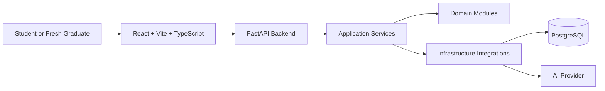
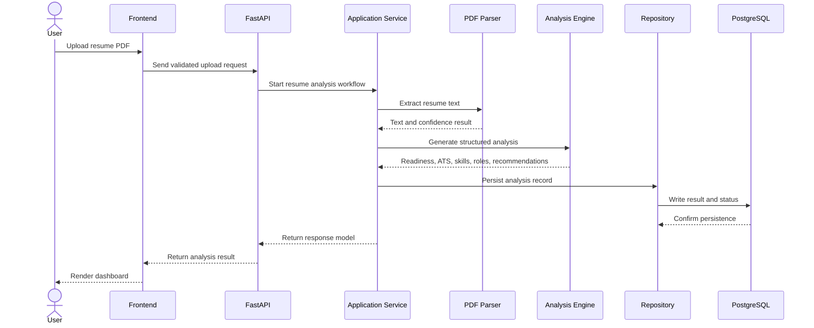

# CareerBoost AI System Architecture

## Status

Canonical technical architecture for Version 1.0.

## High-Level Architecture

CareerBoost AI uses a modular monolith with Clean Architecture boundaries. This is deliberate: the project must remain realistic for one developer while still demonstrating professional separation of concerns.

## Layers

| Layer | Responsibility | Must Not Contain |
| --- | --- | --- |
| Presentation | React UI, FastAPI route handlers, request/response mapping | Business rules, database queries, AI prompts |
| Application | Use-case orchestration, validation pipeline, workflow state | Framework-specific request objects, raw SQL, UI logic |
| Domain | Resume readiness concepts, ATS feedback rules, role matching concepts, recommendation models | FastAPI, React, database drivers, external API clients |
| Infrastructure | PostgreSQL access, PDF parsing libraries, AI provider clients, logging, configuration | Product workflow decisions hidden inside adapters |

## Module Boundaries

| Module | Boundary |
| --- | --- |
| Landing | Presents product value and routes users into upload flow |
| Upload | Handles file selection, client hints, and upload state |
| Parser | Extracts text and confidence metadata from PDFs |
| ATS Evaluation | Assesses resume structure, section clarity, and keyword coverage |
| Skill Extraction | Identifies skills and evidence from resume text |
| Role Matching | Maps profile signals to suitable internship roles |
| Recommendation Engine | Produces prioritized resume and learning actions |
| Dashboard | Presents analysis results without recalculating business logic |
| History | Displays previous analysis records and statuses |
| Configuration | Loads runtime settings from environment variables |
| Logging | Emits structured, privacy-safe logs |

## Communication Flow

## Validation Strategy

- Frontend validation gives fast feedback but is never trusted as final.
- Backend validation is the source of truth for file type, size, readability, and workflow state.
- PDF parsing must report low-confidence extraction rather than pretending analysis is reliable.
- AI output must be validated into structured backend-owned response models before persistence or display.
- Tests must cover success states, invalid inputs, and recoverable failure states.

## Security Boundaries

- AI provider keys must never enter frontend code.
- Resume files and extracted text are sensitive user data.
- Logs must not include full resume text, secrets, private keys, phone numbers, or email addresses extracted from resumes.
- Upload size and content type limits are mandatory.
- Internal exceptions must be logged safely and mapped to user-safe responses.
- CORS must allow only configured frontend origins.

## Current Implementation State

Implemented:

- Backend FastAPI foundation.
- Backend configuration and structured logging foundation.
- Backend `/health` endpoint.
- Frontend Vite React TypeScript foundation.
- Frontend backend-health status panel.
- CI, Dependabot, pre-commit, coverage, and Makefile quality gates.
- PDF-only resume upload endpoint with defensive backend validation.
- User-safe upload validation and extraction failure responses.
- PDF text extraction with extraction confidence metadata.
- Canonical structured analysis response contract.
- Backend resume intake orchestration service.
- Deterministic extracted-text normalization.
- Deterministic section detection for `summary`, `skills`, `experience`, `education`, and `projects`.
- Deterministic completeness baseline based only on detected section presence.
- Upload result UI showing intake metadata, extraction metadata, completeness baseline, detected section details, and extracted-text preview.

Not yet implemented:

- ATS scoring.
- Skill extraction.
- Role matching.
- Recommendations.
- Persistence and analysis history.
- Database schema.
- AI integration.
- Docker runtime artifacts.

The current pipeline prepares resume data for future analysis. It does not claim internship readiness, ATS compatibility, role fit, or improvement recommendations.

Docker remains blocked until a compatible runtime is available and validation can run.
